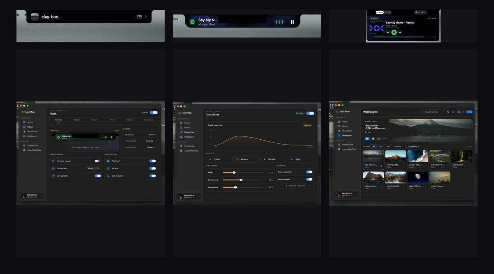
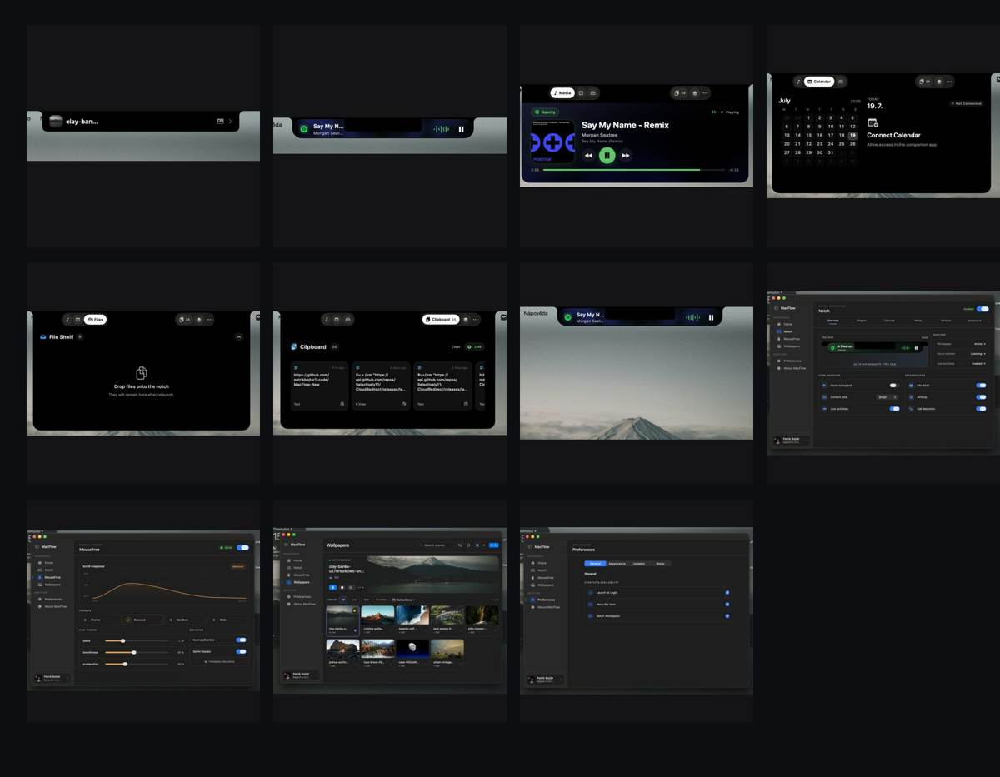

<div align="center">

# MacFlow

### A smarter workspace built around your MacBook notch.

MacFlow turns the notch into a native-feeling control center for media, files, clipboard history, calendar, live activities, and more — with a companion macOS app for customization.

<br>


[](LICENSE)

</div>

<br>

<div align="center">
  
</div>

---

## Overview

MacFlow expands the MacBook notch into a focused workspace that stays available without taking over your desktop. Compact controls appear when you need them, then expand into rich panels for media, clipboard items, files, calendar information, and other live content.

The companion app provides one place to configure notch behavior, integrations, wallpapers, scrolling, appearance, and startup options.

## Highlights

| Feature | What it does |
|---|---|
| **Notch workspace** | Compact and expanded layouts designed around the physical MacBook notch. |
| **Now Playing** | Rich media controls with artwork, track information, progress, and playback actions. |
| **Clipboard** | Browse recent copied text, restore items quickly, pause tracking, or clear history. |
| **File Shelf** | Drop files onto the notch and keep them ready for drag-and-drop workflows. |
| **Calendar** | View the month, today's date, and upcoming calendar information from the notch. |
| **Live activities** | Surface useful status and activity information without opening another window. |
| **MouseFree** | Tune scrolling response with presets, speed, smoothness, and acceleration controls. |
| **Wallpapers** | Browse, organize, favorite, and apply still or live scenes. |
| **Customization** | Configure size, hover behavior, integrations, startup options, and appearance. |

---

## Gallery

<div align="center">
  
</div>

---

## Experience

### Media that feels built into macOS

See album artwork, track metadata, playback state, and progress directly around the notch. The interface scales from a compact glanceable activity to a full media panel.

### Your clipboard, always nearby

MacFlow keeps a visual history of copied text and makes frequently used snippets easy to restore. Clipboard monitoring can be paused or cleared at any time.

### Files without desktop clutter

Drop files onto the notch to keep them temporarily available. The File Shelf provides a fast handoff point between apps and workflows.

### A complete companion app

The main MacFlow window includes dedicated areas for:

- notch layout and behavior
- widget and integration settings
- MouseFree scroll tuning
- wallpaper management
- launch and menu bar preferences

---

## Build from source

```bash
git clone https://github.com/patrikbojtar1-code/MacFlow-New.git
cd MacFlow-New
open NotchLand.xcodeproj
```

Open the project in Xcode, select your development team under **Signing & Capabilities**, and run the macOS target.

> The exact macOS and Xcode requirements may change while the project is under active development. Use the deployment target configured in the Xcode project as the source of truth.

---

## Project status

MacFlow is under active development. Interfaces and behavior may change, and some integrations require macOS permissions before they become available.

Bug reports, feature requests, and focused pull requests are welcome.

## Credits

MacFlow builds on and extends ideas and code from the original **NotchLand** project. Credit belongs to the original contributors for the foundation of the project.

## License

This repository includes an [Apache License 2.0](LICENSE). Third-party components and inherited code may also have their own notices and attribution requirements.

---

<div align="center">

Made for macOS by **Patrik Bojtár**

If MacFlow looks useful, consider giving the repository a star.

</div>
